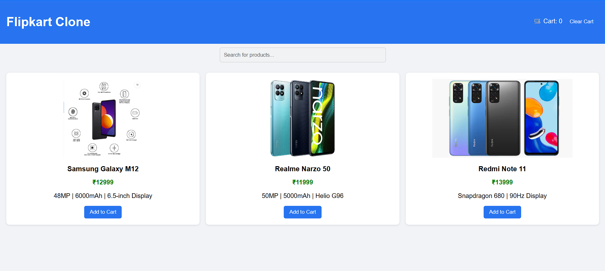

# Flipkart Product Page Clone

A simple responsive product page inspired by Flipkart's design. Built using HTML, CSS, and JavaScript.

## ✨ Features
- Product image, name, price, and description
- Add to Cart functionality (click to increase counter)
- Clean and responsive layout using Flexbox

## 🧰 Tech Stack
- HTML5
- CSS3
- JavaScript (Vanilla)

## 📸 Preview

## 🚀 How to Run Locally
1. Clone this repository:
